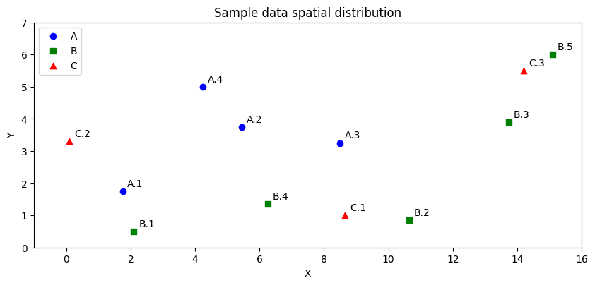

<h1>Co-location Patterns Library</h1>
Python package for discovering co-location patterns from POIs datasets (spatial data).

<h2>1. Package overview</h2>
<h3>1.1. General description of functionality</h3>

Based on [1] a generalized algortihm for mining co-location patterns was implemented. It allows to find
co-locations in dataset containig POIs of different feature types. Required attributes are: <b>unique id</b>, <b>feature
class name</b> (event type name) and <b>geoemtry</b> (lon/lat or x/y point). For now algorithm uses euclidean distance
as neighbourhood relation definition.

<h3>1.2. Example data</h3>

Let's consider some POIs as given in Table 1.

<table style="text-align:center";>
    <caption><i>Table 1: POI data set used in the example</i></caption>
    <tr>
         <th>instance_id</th><th>spatial_feature_type</th><th>geometry</th>
    </tr>
    <tr style="color:blue;"><td>1</td><td>A</td><td>Point(1.75, 1.75)</td></tr>
    <tr style="color:blue;"><td>2</td><td>A</td><td>Point(5.45, 3.75)</td></tr>
    <tr style="color:blue;"><td>3</td><td>A</td><td>Point(8.5, 3.25)</td></tr>
    <tr style="color:blue;"><td>4</td><td>A</td><td>Point(4.25, 5)</td></tr>
    <tr style="color:green;"><td>1</td><td>B</td><td>Point(2.1, 0.5)</td></tr>
    <tr style="color:green;"><td>2</td><td>B</td><td>Point(10.65, 0.85)</td></tr>
    <tr style="color:green;"><td>3</td><td>B</td><td>Point(13.74, 3.9)</td></tr>
    <tr style="color:green;"><td>4</td><td>B</td><td>Point(6.25, 1.35)</td></tr>
    <tr style="color:green;"><td>5</td><td>B</td><td>Point(15.1, 6)</td></tr>
    <tr style="color:red;"><td>1</td><td>C</td><td>Point(8.65, 1)</td></tr>
    <tr style="color:red;"><td>2</td><td>C</td><td>Point(0.1, 3.3)</td></tr>
    <tr style="color:red;"><td>3</td><td>C</td><td>Point(14.2, 5.5)</td></tr>
</table>

In two-dimensional, euclidean space POIs distribution may be presented as on Figure 1.

<figure>
    
    <figcaption><i>Figure 1: Spatial distribution of sample POI data set</i></figcaption>
</figure>

Following co-locations may be found (if <b>R-proximity</b> for neighbourhood
is set for 2.95 and <b>participation index</b> threshold is 0.5:
<ol>
    <li>co-location of features $f_B$ and $f_C$: {B, C}</li>
    <li>co-location of features $f_C$ and $f_A$: {C, A}</li>
</ol>

<h3>Algorithm description (for sample POIs)</h3>

<ol>
    <li>Create elementary tables ($k=1$ co-location level) using $spatial_feature_type$ attribute.</li>
    <li>For $k=1$ co-location level every unique spatial feature type is a colocation. 
It is ignored when calculating statistics</li>
    <li>Increase co-location lever by one ($k=2$).</li>
    <li>Create co-location candidates $k=2$ tables {A, B}, {A, C}, {B, C} (created according to the Cartesian product principle)</li>
    <li>For each candidate table $c$ calculate participation ratio ($pr$) and participation index ($pi$)
using given formulas:
        <ul>
            <li>$pr(c, f_i) = \frac{\pi_{f_i} (|\text{candidate\_table}(c)|)}{|\text{elementary\_table}(f_i)|}$</li>
            <li>$pi(c) = \min_{i=1}^{k} \pr(c, f_i)$</li>
        </ul>
    Where $f_i$ is feature type and $pi_{f_i}$ is a operation for duplicated feature type instances elimination
    If participation index exceeds the established threshold consider candidate as a colocation.
    </li>
    <li>Increase co-location lever by one ($k=3$).</li>
    <li>Create co-location candidate $k=3$ table {A, B, C} and calculate participation ratio and participation index.
If participation index exceeds the established threshold consider candidate as a colocation.</li>
</ol>
The algorithm may be presented as showed on Figure 2:
<figure>
    
    <figcaption><i>Figure 2: Generalized algortihm for mining co-location patterns, based on [1]</i></figcaption>
</figure>

<h2>2. Further work</h2>

<ul>
    <li>Implement other algorithms</li>
    <li>Transfer the burden of calculations to the database engine</li>
    <li>Handle neighborhood definitions other than Euclidean distance, e.g. isohrones</li>
</ul>

<h2>3. Known issues</h2>

<ul>
    None, please let know when occured!
</ul>

<h2>4. Installation</h2>

Package not released yet. For now, just copy git repository and add it's location to Python path in order
to allow imports.

<code>
git clone https://github.com/adnosi3000/colocationpatterns.git
</code>

<h2>5. References</h2>

[1] Huang, Y., Shekhar, S., Xiong, H., 2004. Discovering colocation patterns from spatial data sets: a general approach. IEEE Transactions on Knowledge and Data Engineering 16, 1472–1485. https://doi.org/10.1109/TKDE.2004.90

